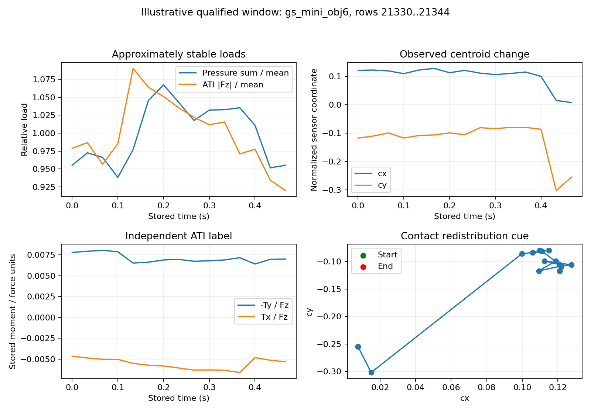
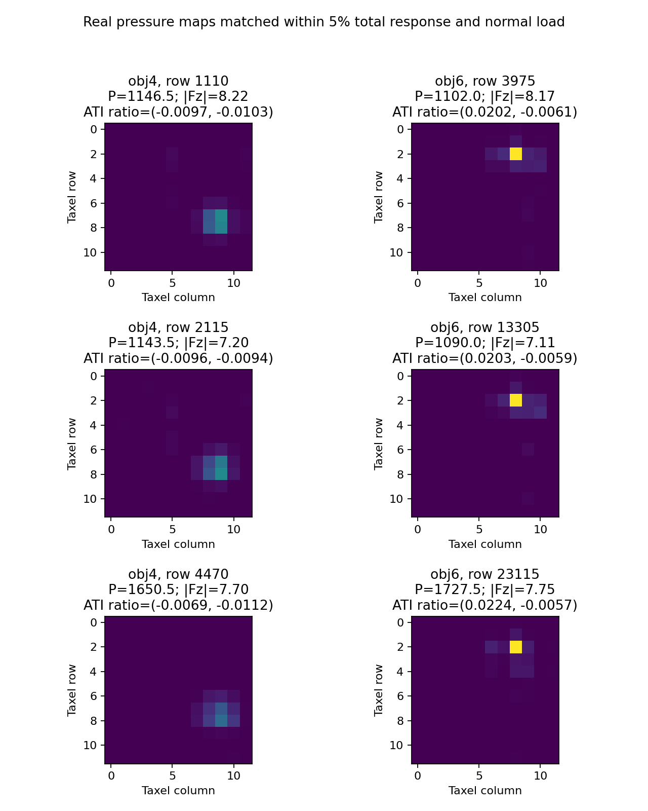

# 空间接触数据筛查与下一轮方案

> 归档说明：这是训练前的筛查与方案记录。后续已完成 TaF 离线验证，并因原测试集全部未通过校准而一次性扩展测试候选；结果与修订见 ../spatial_validation_expanded/空间算子离线验证报告.md。

日期：2026-10-06。状态：已完成公开数据选型、真实片段筛查和导出；尚未运行新目标的 Raw / Physics11D / Learned11D 判决实验。本次不继续试管 BC，不启动 VLA 或 Mamba。

## 当前判断

方向调整有依据：下一轮应该直接考察空间接触信息，而不是反复改动同一个动作预测指标。但上一轮并未证明试管 BC 必然是错误任务，也未证明 Scalar / 本体状态在偏心任务中必然失败。报告里的训练种子方差不能当作传感器重复性；无 NaN 不能当作无噪声或无漂移；CPU 计算 P50≈0.099 ms、P95≈0.208 ms 不能统一表述为“保证 0.1 ms”。

在现有 LeFlexiTac 数据上，用阵列总量或重心自动生成“接触标签”，再让包含这些量的描述子去分类，会形成循环验证。没有独立卡死标签就不能宣称 jamming detection。State-only 是否能利用任务阶段线索，也应实测。

## 更适合的新候选：TaF-Dataset

来源：[数据卡](https://huggingface.co/datasets/jiamig/taf-dataset/blob/main/README.md)、[原论文采集方法](https://arxiv.org/html/2601.20321v1#S3)。论文报告的采集装置支持按压以及 roll / pitch / yaw 扰动，包含 12×12 力阵列和独立 ATI 六维力／力矩，并将数据重采样到 30 Hz。数据卡标注 MIT。

这提供了可独立验证的观测配对：输入是阵列场，标签来自 ATI，而不是从阵列的矩自动生成。公开版本固定为 `239c8ee8156bf11eb6d6c11c004f9a8721528d9d`。

仍需注意：这不是 FlexiTac 本机数据。数据卡称 piezoelectric，论文称 calibrated piezoresistive，传感器类型描述存在差异，需进一步核实。也没有已确认的倾覆、卡死或最佳恢复动作标签。矩阵与 ATI 之间的准确坐标系、安装偏置及单位标定尚未核实，不能直接把力矩／载荷比称为真实 CoP。

## 实际运行的筛查

按固定编号下载 `gs_mini_obj1`～`gs_mini_obj6` 六段源记录，共 **125,260 行**；所有文件 SHA-256 与发布者 LFS 记录一致。只读表格，没有下载视频。

事先写入脚本的资格规则：

1. 每段记录只使用最开始 30 行作为标定前缀；要求全部保存的 |Fz|<0.5。每 taxel 以该前缀的中位数扣 baseline，使用 `3×1.4826×MAD` 截断噪声，此后冻结。ATI 同样扣该前缀中位数。没有从未来搜索更好看的 baseline。
2. 用不重叠 15 行窗口，不跨保存的 episode 边界。窗口内 |Fz|≥2，阵列总响应 P 和独立法向载荷 |Fz| 的变异系数都≤5%。**变异系数≤5%不意味着每一帧都在均值±5%内。**
3. 独立标签定义为 `e=[−Ty/Fz, Tx/Fz]`，只称“ATI 力矩／法向载荷比”。其窗口跨度需≥0.002，单位按保存值理解，不先假定是毫米。
4. 报告低剪切子集：全部帧的 `sqrt(Fx²+Fy²)/|Fz|≤0.2`。即使满足该条件，也不意味着切向力矩贡献为零。
5. 窗口资格不使用阵列重心或方向变化，避免按待测表示本身选择有利样本。

| 源记录 | 原始行数 | 初始标定门槛 | 低剪切合格窗口 |
| --- | ---: | --- | ---: |
| obj1 | 27,000 | 通过 | 88 |
| obj2 | 27,120 | 通过 | 88 |
| obj3 | 32,554 | 未通过，排除 | — |
| obj4 | 4,872 | 通过 | 8 |
| obj5 | 6,438 | 未通过，排除 | — |
| obj6 | 27,276 | 通过 | 132 |
| 合计 | **125,260** | **4/6 通过** | **316** |

“未通过”只是未满足预设标定规则，不代表对应数据完全不可用。本轮不改变门槛追求更多片段。

合格低剪切窗口的归一化重心跨度中位数为 **0.0363**、90% 分位数 **0.0970**、最大值 **0.2525**。这些是筛查后的描述性统计，没有证明信息对控制是必要的。

另从每 15 行抽一个接触样本，在 P 和 |Fz| 各相差≤5%的条件下，寻找独立 ATI 标签差≥0.003的样本对。获得 4,333 个候选，导出 100 对不复用帧的样本。本次按标签距离排序选出的 100 对全部跨源记录，因此**可能混入对象／固定接触位置的混杂，不应直接用它们宣称受扰动态或因果必要性**。它们仅说明：相近总量可能对应不同压力分布和外部力矩关系。

真实窗口没有人工调平压力，也没有生成合成压力图。“近似稳定”与“完全恒定”分开表述。

## 可查看的实际样本

`gs_mini_obj6` 的行 21330～21344 在筛查规则下合格：P 的 CV=4.07%，|Fz| 的 CV=4.60%，最大剪切比=0.188；重心跨度=0.2525。它是合格窗口中重心跨度最大的例子，**仅用于展示，不是随机代表样本或模型成绩**。突变是否由阈值、接触位置跳变或其他因素造成，还需后续检查。

## 下一轮分析计划：先冻结问题，再训练

以下计划是在查看六段记录的资格筛查后制定的，不冒称正式预注册。

**主问题：空间阵列能否在完整源记录留出的条件下，以较低维度预测独立 ATI 的载荷力矩比？** 它是空间物理状态诊断，不是控制任务、倾覆分类或最佳动作预测。

### 数据纪律

- 将已看过的 obj1～obj6 作为开发／资格检查集。
- 新增固定候选 obj7～obj30；先冻结训练 obj7～obj22、验证 obj23～obj26、测试 obj27～obj30。相同标定／资格门槛用于全部集合，失败与排除照样报告。
- 以**完整源记录**为分割单位。当前若干 episode 恰为 3,000 行，可能是一个连续记录的文件切片；不能当作独立物理试验后随机拆分。
- 源记录编号不自动等于独立物体、材质或采集批次；未核实前只称 source-sequence 留出。
- 主结果在全部合格接触帧上报告，低载荷变化窗口作为预先定义的条件子集；不能只报精选的 100 对。
- 每种表示使用相同当前／上一帧可见范围，同一训练／验证／测试划分。归一化和参考量仅来自相应训练子集或明示的初始无接触标定前缀。

### 表示与基线

| 输入 | 用途 |
| --- | --- |
| Scalar：P'、ΔP' | 检查总响应及载荷变化是否已经足够 |
| Scalar + centroid | 检查收益是否仅需要位置，而非完整 11D |
| Physics11D | 固定零至二阶矩、面积、方向与相邻帧差 |
| Raw 当前／上一帧 | 不压缩的阵列参照 |
| Learned11D | 从同样阵列学得的同维表示，认真按验证集调优 |
| 真实 Fz 单标量（辅助诊断） | 排除“Physics 胜出只是其载荷代理标定不同”；不能当部署输入或混进主结果 |

本数据未提供已核实的机器人本体状态，因此不伪造 State-only 基线，也不宣称击败它。

先跑线性读出检查关系，再使用匹配的小型读出；报告总参数量、3 个训练种子、训练子集曲线、逐源记录错误。空间预测输入不包含 Tx/Ty；独立 ATI 只用于标签和协议锁定后的诊断。下一阶段仍不训练 Mamba、VLA 或 token 路径。

### 标签、指标与继续条件

- 直接预测 `e=[−Ty/Fz,Tx/Fz]`，报告逐源记录的 MAE / RMSE 与配对差值。未校准坐标和单位前不报告毫米 CoP 误差。
- 单独报告 P 与独立 |Fz| 近似稳定条件下的性能，检查 Scalar 是否仍可利用残余载荷相关性。
- 按源记录做 bootstrap；仅四个计划测试源记录时，统计结论必须保守，不能把数万帧视为独立重复。
- 检查 baseline、截断（0、3×MAD、5×MAD）敏感性。方向／重心关系若主要随阈值变化，就先回到 Stage 0。
- 若空间表示相对 Scalar 没有可靠增量，修改或降级表示；若仅 centroid 已经足够，不把 11D 的全部分量包装成必要贡献。
- 若 Physics 与 Raw / Learned 相比仅显示成本优势，也应如实只主张成本／紧凑性；不能主张信息更多。
- 即使新目标成功，也只通过离线空间诊断这一层，不能证明防倾倒控制、滑移识别或闭环收益。

## 对方案 A 和自采的安排

LeFlexiTac 的 onset / release 若用阵列阈值生成，只能做算子自洽检查。要做诊断准确率，需要独立视频人工标注、外部力信号或受控接触开关；jamming 还需要独立定义和标注。事件分类成功也不自动证明空间必要性，Scalar 很可能已能解释载荷突变。

后续 FlexiTac 自采应增加：固定载荷范围、随机化偏心方向、固定本体姿态的对照、独立力矩或物体姿态测量。载荷允许预设容差，记录残余变化；不承诺完全恒定。把扰动方向与载荷水平正交随机化，避免 Scalar 通过相关性猜中方向。真实高频噪声、漂移、端到端延迟仍须自采实测。

## 已交付文件

- `stable_load_real_windows.npz`：316×15×12×12 真实预处理阵列、上一帧阵列、独立六维 wrench、源记录和原始行号。
- `stable_load_windows_index.json`：全部窗口与筛查指标，保留数据来源。
- `load_matched_real_pairs.npz`：100 对真实载荷匹配样本，附独立 wrench 和源行号。
- `sequence_audit.json`、`candidate_pairs.json`、`selected_pairs.json`：完整审计、候选和选择记录。
- `protocol.json`、`summary.json`、`window_export_verification.json`：资格规则、结果与导出验证。

复现：从当前任务目录运行 `python outputs/screen_spatial_contact_data.py`，再运行 `python outputs/export_spatial_windows.py`。依赖 NumPy、SciPy、PyArrow、Matplotlib。原始记录缓存在 `work/taf`；原始文件内容未修改。
