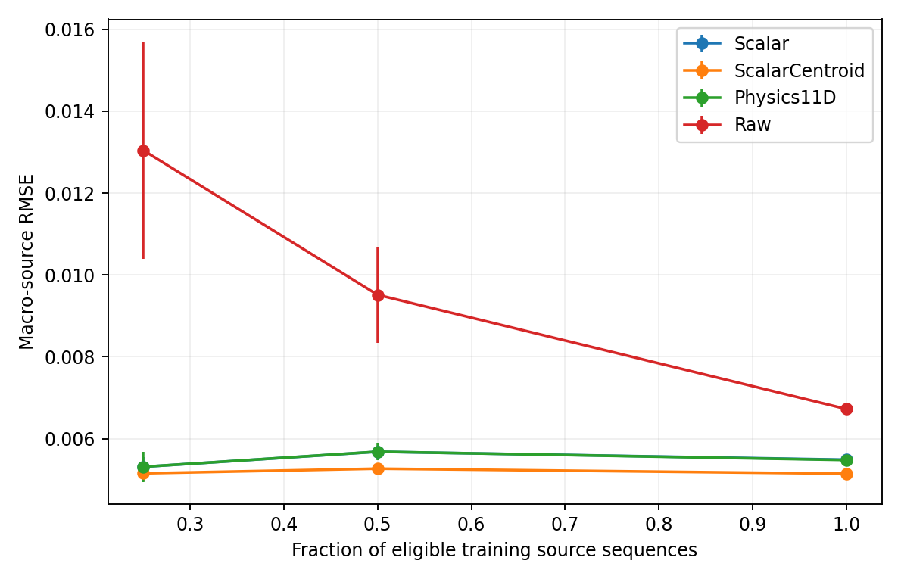

# TaF 空间接触算子离线验证

日期：2026-10-06。已实际运行源记录留出实验；本轮不继续试管 BC、不训练 Mamba 或 VLA。

## 核心结果

完整 11D 的神经读出相对 Scalar 的全部接触帧 RMSE 变化为 +0.6%，相对 Scalar+centroid 为 +4.2%，相对 Raw 为 -7.8%，相对 Learned11D 为 -11.4%（负数表示误差更低）。稳载子集相对 Scalar 的均值 RMSE 变化为 -6.4%，但逐源配对 MSE 区间跨零，优势未可靠成立。相对 Scalar+centroid 也没有额外收益。窗口内变化诊断中，11D 比不预测变化的静态参照误差高 10.2%。因此此次不能宣布 Stage 1 通过，不能把完整 11D 包装成空间动态的必要表示。

以下 RMSE 是先在每个源记录内对两维误差求 RMSE，再等权平均源记录，神经模型再平均 3 个种子。单位为发布数据中保存的力矩／力比，未核实坐标、安装偏置及绝对单位，不能写成毫米 CoP 误差。

### 神经读出，3 个训练种子

| 输入 | 全部接触帧 RMSE | 稳定载荷子集 RMSE |
| --- | ---: | ---: |
| Scalar | 0.005439 | 0.005481 |
| ScalarCentroid | 0.005252 | 0.005024 |
| Physics11D | 0.005474 | 0.005128 |
| Raw | 0.005935 | 0.005465 |
| Learned11D | 0.006176 | 0.005802 |

### 线性读出

| 输入 | 全部接触帧 RMSE | 稳定载荷子集 RMSE |
| --- | ---: | ---: |
| Scalar | 0.005487 | 0.005546 |
| ScalarCentroid | 0.005146 | 0.004758 |
| Physics11D | 0.005478 | 0.005199 |
| Raw | 0.006724 | 0.006464 |
| FzOracle | 0.005539 | 0.005559 |

FzOracle 仅是外部真实法向载荷的辅助诊断参照，不是可部署的阵列模型，也不包含 Tx/Ty。完整训练集的 Ridge 是确定性拟合，3 个种子产生同样模型；其零种子方差不是传感器稳定性。

## 数据与协议变更

来源：[TaF 数据卡](https://huggingface.co/datasets/jiamig/taf-dataset/blob/main/README.md)、[原论文采集方法](https://arxiv.org/html/2601.20321v1#S3)。固定发布 SHA：`239c8ee8156bf11eb6d6c11c004f9a8721528d9d`。仅下载压力阵列和 ATI 表格，没有使用图像。全部源文件 SHA-256 校验通过。

原计划训练 obj7～22、验证 obj23～26、测试 obj27～30，但原定 4 个测试记录全部未满足初始无接触校准门槛。此时未训练任何模型。保留原协议和失败审计后，一次性将固定测试候选扩大为 obj27～54，训练／验证范围与校准门槛保持原值；在下载 obj31～54 前冻结修订，没有按预测成绩选择样本。它是透明的可行性修订，并非正式预注册。

共检查 48 个源记录、1,185,625 原始帧。按预定门槛排除：[7, 12, 15, 17, 18, 19, 23, 26, 27, 28, 29, 30, 44, 45, 46, 47, 48, 52, 53]。有效集合为：

- 训练：[8, 9, 10, 11, 13, 14, 16, 20, 21, 22]。
- 验证：[24, 25]。
- 测试：[31, 32, 33, 34, 35, 36, 37, 38, 39, 40, 41, 42, 43, 49, 50, 51, 54]。
- 优化使用 80,512 帧，验证调参使用 10,366 帧；测试遍历全部 417,986 合格接触帧，稳定载荷子集 22,838 帧。

完整源序列不跨集合；转换后的 episode 很可能是连续记录切片，不作为独立试验。编号不自动等于不同物体／材质。初始校准门槛会筛掉从受力开始记录的数据，因此结论只覆盖可按该协议校准的源记录，而非整个 TaF 数据集。

## 标签、预处理与公平性

标签来自独立 ATI：`e=[-Ty/Fz, Tx/Fz]`，包含两个保存单位下的力矩／法向载荷比。输入模型从不包含 ATI 的 Tx/Ty，也没有机器人本体状态输入。

每源记录前 30 帧要求全部保存值 |Fz|<0.5；以其每 taxel 中位数扣基线、按 3×1.4826×MAD 阈值保留正响应，此后冻结。ATI 同样扣前缀中位数。评价帧要求行号≥31、与前一帧同转换 episode、|Fz|≥2、阵列质量非零且标签有限。当前帧及上一帧的可见历史一致，不用未来帧滤波、不进行 EMA。

Scalar 为 log1p 总响应及相邻差分；ScalarCentroid 增加 cx/cy 及差分；Physics11D 为 8 个静态统计量加总响应与质心的 3 个差分。协方差方向使用各向异性加权的双角编码，各向同性时衰减到零。坐标按阵列两轴归一化到 [-1,1]。所有模型另外共享当前／上一帧有效性标志，不计入 11D；Learned11D 将 Raw 的 288 个值编码到 11D，标志同样绕过瓶颈。

神经读出统一 64→64→2 的隐藏层宽度；Learned11D 编码器为 288→64→11。头部宽度一致不等于参数总量相等，实际参数数目记录在 all_results.json。4 组 lr/weight-decay 仅按验证集选择，3 个种子为 7/19/31；最多 200 epoch，20 epoch patience。各源记录等权损失；输入、输出尺度与 P_ref 均只由训练子集估计。神经训练和选择使用训练输出标准化后的 MSE；线性 alpha 使用保存单位下验证 MSE。

线性数据曲线按训练源记录抽取 25%、50%、100%，每档 3 个固定种子，重新估计子集基准和尺度；alpha 沿用完整训练集验证选择。因此它是表示的数据效率诊断，未隔离超参数选择所需的额外数据。神经模型此次只跑完整训练集，尚未证明神经小样本优势。

## 配对统计与边界

以完整测试源记录做 10,000 次 cluster bootstrap，先平均神经种子的逐源 MSE，再比较 Physics11D 与对应模型。差值<0表示 Physics 更低误差；这不是把每帧视作独立样本的显著性检验。源记录数少、来源独立性未核实，区间仅作描述性不确定性，不能替代重复物理实验。

| 模型族 | 评价集 | 配对比较 | 平均 MSE 差值 | bootstrap 95% 区间 | Physics 更好的源记录 |
| --- | --- | --- | ---: | --- | --- |
| linear | test | Physics11D minus Scalar | -0.00000122 | [-0.00001210, 0.00000988] | 11/17 |
| linear | test | Physics11D minus ScalarCentroid | 0.00000378 | [-0.00000100, 0.00000938] | 8/17 |
| linear | test | Physics11D minus Raw | -0.00001816 | [-0.00003704, -0.00000272] | 13/17 |
| linear | conditional | Physics11D minus Scalar | -0.00000238 | [-0.00001379, 0.00001299] | 13/17 |
| linear | conditional | Physics11D minus ScalarCentroid | 0.00000519 | [0.00000026, 0.00001181] | 7/17 |
| linear | conditional | Physics11D minus Raw | -0.00001706 | [-0.00004500, 0.00000483] | 12/17 |
| neural | test | Physics11D minus Scalar | -0.00000046 | [-0.00000946, 0.00000864] | 12/17 |
| neural | test | Physics11D minus ScalarCentroid | 0.00000217 | [-0.00000281, 0.00000799] | 8/17 |
| neural | test | Physics11D minus Raw | -0.00000530 | [-0.00001330, 0.00000237] | 13/17 |
| neural | test | Physics11D minus Learned11D | -0.00000956 | [-0.00001827, -0.00000078] | 15/17 |
| neural | conditional | Physics11D minus Scalar | -0.00000364 | [-0.00001435, 0.00000898] | 13/17 |
| neural | conditional | Physics11D minus ScalarCentroid | 0.00000011 | [-0.00000577, 0.00000590] | 9/17 |
| neural | conditional | Physics11D minus Raw | -0.00000339 | [-0.00001036, 0.00000489] | 13/17 |
| neural | conditional | Physics11D minus Learned11D | -0.00000915 | [-0.00001505, -0.00000352] | 15/17 |

稳定载荷子集按不重叠 15 帧窗口筛选：P 和独立 |Fz| 的 CV≤5%、|Fz|≥2、独立标签跨度≥0.002、全部剪切比≤0.2。门槛不使用质心／方向变化，但它使用窗口内 ATI 标签，因此这是离线条件诊断，不能说是在线事件检测。CV≤5%也不表示每帧载荷都在±5%内。

## 阈值敏感性与验证

`sensitivity.json` 保留 cutoff=0、5×MAD 的线性模型结果，沿用主实验选择的 alpha，未依据测试集重调门槛、参考尺度或参数。资格与评价帧保持主协议成员不变，阈值更改后额外零质量由共享有效标志处理。

| 阈值 | 输入 | 全部接触帧 RMSE | 稳定载荷 RMSE |
| --- | --- | ---: | ---: |
| 0×MAD | Scalar | 0.005486 | 0.005546 |
| 0×MAD | ScalarCentroid | 0.005145 | 0.004756 |
| 0×MAD | Physics11D | 0.005514 | 0.005228 |
| 0×MAD | Raw | 0.006759 | 0.006533 |
| 3×MAD | Scalar | 0.005487 | 0.005546 |
| 3×MAD | ScalarCentroid | 0.005146 | 0.004758 |
| 3×MAD | Physics11D | 0.005478 | 0.005199 |
| 3×MAD | Raw | 0.006724 | 0.006464 |
| 5×MAD | Scalar | 0.005488 | 0.005548 |
| 5×MAD | ScalarCentroid | 0.005144 | 0.004757 |
| 5×MAD | Physics11D | 0.005477 | 0.005197 |
| 5×MAD | Raw | 0.006716 | 0.006446 |

初次 float32 Ridge 的正规方程出现 scipy 病态矩阵警告，未解释其成绩便改为 float64 求解，按同一 alpha 网格重跑。原始数值试跑日志保留，主表只使用双精度修正版；这项修正没有改变评价定义或按测试表现选参数。

`artifact_verification.json` 记录保存模型在 CPU 冷加载后的预测与 CUDA 保存结果比较，源分割核查、所有预测有限性，以及真实阵列协方差迹恒等式检查。接近 epoch 上限的模型也单独列出；若存在，不应把该模型成绩当作已充分收敛的最优表示上限。

## 额外诊断：窗口内动态，而非固定偏置

在查看模型预测成绩之前，额外冻结了窗口中心化诊断（secondary_diagnostic_protocol.json）。仅对已经合格的稳定载荷窗口，分别减去每个窗口的标签均值和预测均值，再比较变化误差；它是评价时的回顾性分解，不进入输入预处理，不据此重新训练／挑参数。共 1523 个测试窗口。

| 输入 | 窗口内变化 RMSE（神经读出均值） |
| --- | ---: |
| 不预测窗口内变化的参照 | 0.001025 |
| Scalar | 0.001024 |
| ScalarCentroid | 0.001055 |
| Physics11D | 0.001129 |
| Raw | 0.001184 |
| Learned11D | 0.001231 |

静态参照的窗口内预测为零变化。若模型低于该参照，支持其捕捉部分窗口内变化；若高于，则不能拿静态标签 RMSE 的改善宣称动态接触追踪有效。此项为补充诊断，并非原始主指标。

## 结论应怎样使用

成功预测该独立标签最多支持“空间表示含有外部力矩关系的可用信息”。不能直接证明接触位置绝对标定、滑移识别、卡死、最佳恢复方向或闭环防倾倒效果。TaF 与 FlexiTac 硬件不同，公开记录约 30 Hz；高频噪声、漂移与真实端到端时延仍需要 FlexiTac 自采。

若只有 ScalarCentroid 已足够，应缩减或降级完整 11D 的必要性表述。若 Raw / Learned 表现更好，应承认物理瓶颈的信息损失，不能把低计算成本当作更高信息量。若低载荷子集与主结果相反，必须同时报告，而不是挑更有利的结果。

## 复现与文件

在任务目录运行 `python outputs/run_spatial_validation.py --prepare-only`，再运行 `python outputs/run_spatial_validation.py`，最后运行 `python outputs/report_spatial_validation.py`。依赖 NumPy、PyArrow、SciPy、scikit-learn、PyTorch CUDA、Matplotlib；此次 GPU：NVIDIA GeForce RTX 5060 Laptop GPU，PyTorch：2.11.0+cu128。代码与实验结果归档于 experiments/contact_operator；本报告描述离线试验，不包含实机验证。

数据原文缓存在 work/taf；outputs 保留 protocol.json、完整 data_audit.json、eligible_split.json、线性曲线与 alpha、验证调参日志、3 种子模型及预测、逐源误差和敏感性结果。训练脚本和报告脚本是可编辑的复现来源。
