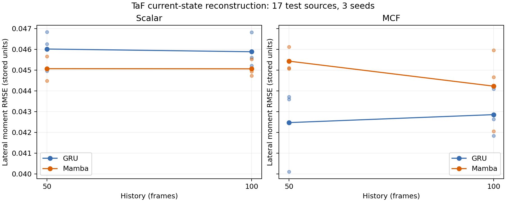

# Stage 2P：Mamba 与 GRU 离线 Now-casting 对照

## 实测结论

- MCF T=50：GRU力矩RMSE 0.0424707，Mamba 0.0454305；Mamba降幅 -6.97%。Mamba−GRU MSE的95%源配对区间 [0.000166158, 0.000318061]。
- MCF T=100：GRU力矩RMSE 0.0428548，Mamba 0.0442267；Mamba降幅 -3.20%。Mamba−GRU MSE的95%源配对区间 [3.08556e-05, 0.00018242]。
- MCF-Mamba从T50增加到T100：侧向力矩RMSE降幅 2.65%；MSE差的95%区间 [-0.00015035010611766259, -3.4667023653894915e-05]。
- 这些结果对应固定小模型、既定数据划分和沿用的GRU优化超参数；本轮完成架构替换对照，不是Mamba超参数最优性搜索。
- 原生Mamba eager P95为 1.944–2.077 ms；同权重CUDA Graph P95为 0.145–0.153 ms。四组各1,000帧Graph测量均低于1ms，测量范围是GPU驻留输入的模型推理；GRU同样优化后更快，未得到Mamba速度优于GRU的结论。

2026-10-07。24 组训练完成。Stage 1 和此前 GRU 实验均保留。

## 实验设置

- 输入 Scalar `[f,Δf]` / MCF8；标签为当前 ATI `[Fx,Fy,Mx,My]`，不预测未来。历史 T=50/100；种子7/19/31。
- GRU：两层 hidden64，47,460 参数。Mamba-1：两层 residual + RMSNorm block，d_model50、expand2、state16、causal conv4，47,978 参数（多1.09%）。原 token MLP 和 pool 前端相同；Mamba 增加32→50投影并使用50→4输出。是参数量级匹配，不是逐参数完全相等。
- Mamba 后端为 `mambapy==1.2.0`，PyTorch 并行 selective scan 和逐帧 step；没有使用官方融合 CUDA 内核。具有输入相关 Δ/B/C、门控、因果卷积和 SSM 递推。
- FP32，matmul/cuDNN TF32 均关闭；相同 AdamW lr0.001 / wd0.0001、batch64、最多40epoch、patience8。按等权源的归一化验证MSE选择epoch。没有按测试分数调参。
- T100公共样本：训练 6065、验证 739、测试 9867；源数量分别 10/2/17。T50和T100、GRU和Mamba使用完全相同锚点。
- 从此前完整锚点网格取有100帧连续历史的子集；保留stride20、接触活跃阈值和末端30帧余量。差分还使用窗口首帧的前一帧；检查同episode。训练源输入归一化、每源空载首30帧ATI零偏处理不变。
- 力、力矩分开评分，单位沿用数据保存单位。先计算每个源RMSE，再等权平均源和三个种子。

## RMSE

| T | 输入 | GRU 剪切力 | Mamba 剪切力 | GRU 侧向力矩 | Mamba 侧向力矩 | Mamba 力矩降幅 |
|---:|---|---:|---:|---:|---:|---:|
| 50 | Scalar | 1.0279115 | 1.0140310 | 0.0460152 | 0.0450682 | 2.06% |
| 50 | MCF | 1.0510197 | 1.0922404 | 0.0424707 | 0.0454305 | -6.97% |
| 100 | Scalar | 0.9699990 | 0.9927413 | 0.0458842 | 0.0450618 | 1.79% |
| 100 | MCF | 1.0445740 | 1.0852279 | 0.0428548 | 0.0442267 | -3.20% |

正降幅表示Mamba误差更低。新表的GRU也在公共子集上重跑，不能将旧T50结果直接拼入本表。

## 配对不确定性

三个种子的每源MSE先平均，再对测试源进行10,000次配对bootstrap；以下是差值的95%区间。负数有利于左项。未把相邻帧视作独立重复；这是固定种子集合下的源级区间，未校正多重比较。

| 比较 | 剪切力 MSE CI | 侧向力矩 MSE CI |
|---|---|---|
| Mamba-GRU Scalar T50 | [-0.093634, 0.0051911] | [-0.00015434, -4.297e-05] |
| Mamba-GRU MCF T50 | [0.0088315, 0.13354] | [0.00016616, 0.00031806] |
| Mamba-GRU Scalar T100 | [0.0057665, 0.062264] | [-0.00016879, 6.962e-06] |
| Mamba-GRU MCF T100 | [-0.046481, 0.15639] | [3.0856e-05, 0.00018242] |
| GRU Scalar T100-T50 | [-0.16461, -0.06767] | [-7.7496e-05, 4.4776e-05] |
| GRU MCF T100-T50 | [-0.041007, 0.050069] | [-2.549e-05, 0.0001125] |
| GRU T50 MCF-Scalar | [-0.084966, 0.17245] | [-0.00072981, 5.794e-05] |
| GRU T100 MCF-Scalar | [0.038753, 0.28296] | [-0.00074541, 0.00017714] |
| Mamba Scalar T100-T50 | [-0.077117, -0.007924] | [-3.6899e-05, 3.8573e-05] |
| Mamba MCF T100-T50 | [-0.03796, 0.012011] | [-0.00015035, -3.4667e-05] |
| Mamba T50 MCF-Scalar | [0.086674, 0.23216] | [-0.0003392, 0.00033049] |
| Mamba T100 MCF-Scalar | [0.11357, 0.26318] | [-0.00045095, 0.00026154] |

## batch=1 流式延迟

seed7模型，真实测试episode连续最多1,000帧；100帧预热后重置状态。每帧同步GPU测量墙钟时间，输入已在GPU。包含模型前端与输出头；不包含传感器、特征提取和传输。原生eager后端，不使用CUDA Graph或融合Mamba内核。

| 架构 | 输入 | 训练T | P50 ms | P95 ms | P99 ms | 最大 ms | <1ms比例 | 状态字节 |
|---|---|---:|---:|---:|---:|---:|---:|---:|
| GRU | Scalar | 50 | 0.498 | 0.617 | 0.809 | 1.441 | 99.8% | 512 |
| GRU | MCF | 50 | 0.501 | 0.598 | 0.720 | 1.207 | 99.9% | 512 |
| GRU | Scalar | 100 | 0.498 | 0.581 | 0.694 | 0.940 | 100.0% | 512 |
| GRU | MCF | 100 | 0.500 | 0.596 | 0.680 | 1.067 | 99.9% | 512 |
| Mamba | Scalar | 50 | 1.715 | 1.944 | 2.176 | 3.034 | 0.0% | 15200 |
| Mamba | MCF | 50 | 1.689 | 2.032 | 3.194 | 5.862 | 0.0% | 15200 |
| Mamba | Scalar | 100 | 1.706 | 1.957 | 2.175 | 3.111 | 0.0% | 15200 |
| Mamba | MCF | 100 | 1.718 | 2.077 | 2.395 | 2.981 | 0.0% | 15200 |

这是本机本后端的实测，不能等同于官方融合内核的速度。缓存大小与累计历史长度无关；GRU同样具有固定状态递推。窗口RMSE对应每窗口清零状态；连续流式测试用于延迟，不能自动等同于无限历史在线RMSE。

## 核验与产物

- 并行扫描/顺序扫描前向和参数、输入梯度一致；T=1/50/100流式与整段输出一致，因果检查通过。
- 独立对照 Transformers 4.57.6 的 MambaMixer.slow_forward，复制相同权重后核验前向与梯度。详见 hf_reference_checks.json。
- 24组预测指标独立复算；8组seed7模型CPU冷加载和训练后流式一致性检查通过。公共子集的ATI标签、episode、时间戳与旧nowcast逐元素一致。
- 模型权重、每个测试窗口预测、训练损失轨迹、最佳epoch、样本索引、协议及源码哈希均保存。
- 本轮验证的是该规模Mamba对当前ATI重构的表现，不直接标定微滑移、剪切应变或确定GRU长历史瓶颈的物理原因。

[结构化汇总](summary.json) · [完整模型结果](results.json) · [训练协议](protocol.json) · [复现说明](README.md)

实现来源：[Mamba 官方](https://github.com/state-spaces/mamba)、[mamba.py 后端](https://github.com/alxndrTL/mamba.py)。

## 训练选择记录

| 架构 | 输入 | T | 种子 | 最佳 epoch | 验证损失 | 训练秒 |
|---|---|---:|---:|---:|---:|---:|
| GRU | Scalar | 50 | 7 | 5 | 2.38462 | 6.9 |
| GRU | Scalar | 50 | 19 | 9 | 2.42501 | 8.7 |
| GRU | Scalar | 50 | 31 | 16 | 2.34333 | 12.3 |
| GRU | MCF | 50 | 7 | 17 | 2.04807 | 12.8 |
| GRU | MCF | 50 | 19 | 9 | 1.99113 | 8.7 |
| GRU | MCF | 50 | 31 | 11 | 1.94160 | 9.7 |
| GRU | Scalar | 100 | 7 | 16 | 2.23530 | 13.8 |
| GRU | Scalar | 100 | 19 | 17 | 2.23791 | 14.3 |
| GRU | Scalar | 100 | 31 | 7 | 2.32224 | 8.6 |
| GRU | MCF | 100 | 7 | 17 | 1.95683 | 14.3 |
| GRU | MCF | 100 | 19 | 9 | 1.92152 | 9.8 |
| GRU | MCF | 100 | 31 | 11 | 1.95825 | 10.8 |
| Mamba | Scalar | 50 | 7 | 16 | 2.18929 | 45.6 |
| Mamba | Scalar | 50 | 19 | 13 | 2.26159 | 39.3 |
| Mamba | Scalar | 50 | 31 | 19 | 2.28107 | 50.5 |
| Mamba | MCF | 50 | 7 | 8 | 2.15111 | 29.8 |
| Mamba | MCF | 50 | 19 | 3 | 2.24879 | 20.6 |
| Mamba | MCF | 50 | 31 | 9 | 2.30079 | 31.7 |
| Mamba | Scalar | 100 | 7 | 13 | 2.09558 | 76.4 |
| Mamba | Scalar | 100 | 19 | 15 | 2.13470 | 83.6 |
| Mamba | Scalar | 100 | 31 | 7 | 2.24432 | 54.6 |
| Mamba | MCF | 100 | 7 | 3 | 2.07139 | 40.0 |
| Mamba | MCF | 100 | 19 | 3 | 2.15378 | 40.0 |
| Mamba | MCF | 100 | 31 | 2 | 2.25050 | 36.4 |

## 同权重 CUDA Graph 部署补测

此补测在全部训练结束后进行，不重新训练，也不修改窗口预测或选模。两种架构使用相同的Graph优化方式；固定输入/状态缓冲，重放同一组FP32计算。测量包含GPU内输入拷贝、Graph replay及同步，不包含Graph构建、传感器和特征计算。

| 架构 | 输入 | T | P50 ms | P95 ms | P99 ms | 最大 ms | <1ms比例 | 与eager误差 |
|---|---|---:|---:|---:|---:|---:|---:|---:|
| GRU | Scalar | 50 | 0.070 | 0.076 | 0.086 | 0.119 | 100.0% | 0 |
| GRU | MCF | 50 | 0.071 | 0.080 | 0.108 | 0.130 | 100.0% | 0 |
| GRU | Scalar | 100 | 0.071 | 0.087 | 0.114 | 0.131 | 100.0% | 0 |
| GRU | MCF | 100 | 0.070 | 0.076 | 0.091 | 0.133 | 100.0% | 0 |
| Mamba | Scalar | 50 | 0.119 | 0.145 | 0.164 | 0.327 | 100.0% | 0 |
| Mamba | MCF | 50 | 0.124 | 0.153 | 0.178 | 0.318 | 100.0% | 0 |
| Mamba | Scalar | 100 | 0.126 | 0.147 | 0.174 | 0.665 | 100.0% | 0 |
| Mamba | MCF | 100 | 0.118 | 0.150 | 0.173 | 0.273 | 100.0% | 0 |

完整逐帧延迟在 `cuda_graph_benchmark.json`。Graph优化结果和原生eager结果分别报告；即使P95低于1ms，也不等于所有帧严格小于1ms。

