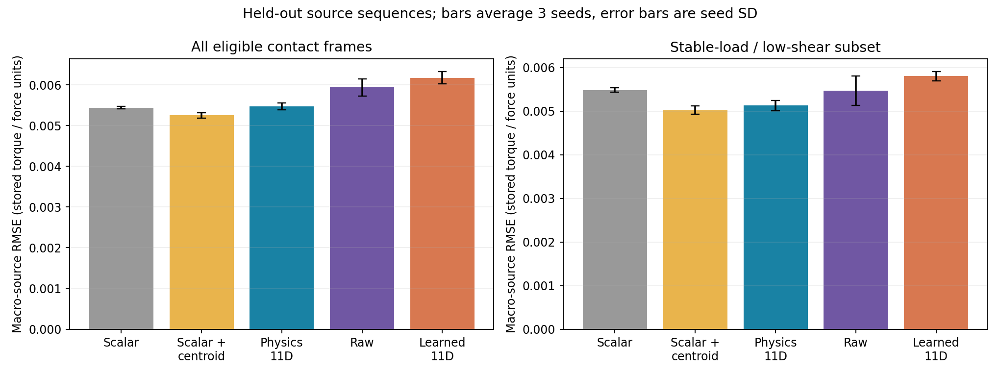

# 2026-10-06 离线成果与当前决策

**完整 11D 仍是候选表示，当前不能宣布 Stage 1 通过。** 已获得可复现的数学检查、信息丢失反例、公开数据筛查、两轮表示对比与明确的失败边界。没有 Mamba / VLA / tactile-token policy 或实机控制结果。

本页提供最新判断；详细结果保持原实验的探索性状态、原假设和透明协议修订，不追溯性改写成成功验证。代码和归档见 [实验入口](../experiments/contact_operator/README.md)。

## 数学检查与信息损失

对于非负权重和正总量，质心与协方差是加权一阶／二阶中心矩。1,000 个随机样本检查载荷统一缩放、坐标平移与中心矩关系，最大误差约 6.11×10⁻¹⁶；各向同性方向编码归零。测试使用正质量精确分母，不能冒称仓库 `P+ε` 公式的严格不变量。

精确反例：五个位置 x=[−1,−0.5,0,0.5,1]，y=0，响应 A=[11,6,16,6,11] 与 B=[9,14,4,14,9]。它们的总量、质心、二阶矩、共同低阈值面积与方向相同，恒定历史的差分也相同，完整 11D 差异为零，Raw L2 距离约 16.7332。这是合成数学反例，不是真实受扰或闭环失败。

因此 11D 不是无损压缩，也没有建立“最小充分物理状态”证明。√λ 是加权标准差，不自动等于接触斑几何半轴；Δc 是接触响应重分布线索，不自动等于滑移。

附带 HTT 筛查仅使用未核实空间映射的 72 通道 L1 响应，不强行 reshape 或冒称完整法向 11D。12 条 Xela 记录、12,692 帧，8 条训练／4 条测试；log-L1 的平均法向力 MAE 为 3.052，相比 L1 的 4.107 更低，但不是空间表示验证或 OOD。[初步报告](../experiments/contact_operator/outputs/算子初步验证.md)。

## LeFlexiTac：动作预测未显示额外收益

数据为公开 test-tube 保存响应，12×32、约 30 Hz，共 64 episode、75,041 帧。完整 episode 划分为 44 训练、10 验证、10 测试；测试在探索性初轮之后复用，因此不是独立确认性证据，也不是已核实 OOD。

目标是 `action[t+5]-state[t]`，约 167 ms 后的操作员位置指令偏差。所有模型共享当前本体状态与后向变化率；触觉模型还共享接触有效性标志和相同当前／前一帧范围。验证集选择超参数，神经模型使用 3 个种子。

| 输入 | 全训练预算 normalized MSE 均值 |
| --- | ---: |
| State-only | 0.244428 |
| State + Scalar | 0.241319 |
| State + Physics11D | 0.255532 |
| State + Raw | 0.373856 |
| State + Learned11D | 0.321041 |

Physics 相对 State-only 的平均误差高约 4.5%。它优于此次小型 Raw / Learned 模型，不足以证明空间触觉具有增量价值，也不能推广成优于完整 CNN、官方 token 路径或所有高维表示。[主要报告](../experiments/contact_operator/outputs/offline_validation_tuned/离线验证报告.md)。

本机 CPU 的 EMA、截断、矩、差分和状态更新计算 P50=0.0987 ms、P95=0.2078 ms，排除采样、传输、策略、执行器及事件标签。这是计算路径测量，不能写成 100 Hz 无漂移、高频闭环或固定 0.1 ms 反射。硬件噪声、漂移和重复性未测。

## TaF：换独立空间标签后的结果

TaF 提供 12×12 阵列与同步独立 ATI 六维力／力矩。先按固定 obj1～6 筛查，得到 316 个低剪切、P 和 |Fz| 的 CV≤5% 的真实窗口；导出 100 对载荷匹配样本。精选样本对全部跨源记录，可能混入对象与接触位置偏置，只是检索例子，不作为因果判决成绩。[筛查与训练前方案](../experiments/contact_operator/outputs/spatial_contact_screen/空间接触数据筛查与下一轮方案.md)。

新目标为独立 ATI 的 `[-Ty/Fz, Tx/Fz]`；输入不含 ATI 的 Tx/Ty。未核实绝对单位、坐标系与安装偏置，以下均是保存单位下的力矩／力比误差，不称毫米 CoP 或最佳纠偏动作。

### 数据纪律与修订

原定训练 obj7～22、验证 obj23～26、测试 obj27～30。原测试 4 记录全部不满足“开头 30 帧 |Fz|<0.5”的校准门槛，尚未训练模型时，一次性把固定测试候选扩大为 obj27～54；保留原划分／失败审计，未改校准门槛，未按模型成绩选记录。

最终 10 个训练源记录、2 个验证源记录、17 个测试源记录，共 690,756 个合格接触帧。优化使用 80,512 帧，验证调参 10,366 帧；最终评价全部 417,986 测试帧，其中 22,838 帧属于稳载／低剪切子集。记录不跨集合；episode 可能是连续记录切片。编号不自动等于不同物体、材质或独立采集批次。

该校准门槛排除了受力起始记录，结论只覆盖可按此协议校准的记录。所有排除逐条保留，不以“只有成功的样本”作为整个数据集的代表。

### 神经读出主要结果

RMSE 先在每源记录内计算，再等权平均源记录，最后平均 3 个训练种子。各表示共享前一帧可见范围与当前／前一帧有效性标志；标志不计入 11D。

| 输入 | 全部接触帧 RMSE | 稳载／低剪切子集 RMSE |
| --- | ---: | ---: |
| Scalar | 0.005439 | 0.005481 |
| Scalar + centroid | **0.005252** | **0.005024** |
| Physics11D | 0.005474 | 0.005128 |
| Raw | 0.005935 | 0.005465 |
| Learned11D | 0.006176 | 0.005802 |

稳载子集上 11D 相对 Scalar 的平均 RMSE 低 6.4%，但按源记录配对的 MSE 差 bootstrap 95% 区间为 [−1.435×10⁻⁵, 8.983×10⁻⁶]，跨零，优势不可靠。完整 11D 相对总量＋质心没有额外收益。训练种子误差条不是物理重复试验的置信区间。

在此次固定模型与协议下，Physics 优于 Learned11D 的逐源配对 MSE 区间未跨零，显示解析瓶颈相对这个学习型基线的有限证据；但不能据此忽略更好的简化质心输入、整体相对 Scalar 的弱增量或动态诊断的负结果。

### 窗口内变化诊断

在查看预测成绩前补充冻结窗口均值消除诊断。对 1,523 个已合格窗口，分别扣除标签均值和预测均值，观察动态变化误差；这是回顾性评价分解，不进入模型输入，不据此重调模型。

| 参照／输入 | 窗口内变化 RMSE |
| --- | ---: |
| 不预测变化的静态参照 | 0.001025 |
| Scalar | 0.001024 |
| Scalar + centroid | 0.001055 |
| Physics11D | 0.001129 |

11D 的误差比静态参照高约 10.2%。因此较低的静态目标误差不能被包装成动态接触追踪有效。此项是补充指标，不是原始主指标，也不证明算子永远不能追踪其他真实动态。

线性 Ridge、25%／50%／100% 数据曲线、全部种子、逐源错误、cutoff=0／3／5×MAD 的敏感性与配对统计均保留。阈值检查未改变主要判断。初次 float32 Ridge 病态矩阵警告通过 float64 求解修正，原数值试跑留档，主表采用修正版。[完整 TaF 报告](../experiments/contact_operator/outputs/spatial_validation_expanded/空间算子离线验证报告.md)。

## 验证范围与下一步

源分割、预测有限性、真实数组协方差迹恒等式检查通过；保存的主要模型 CPU 冷加载与 CUDA 预测最大绝对差约 3.35×10⁻⁸。它们验证实现和归档，不替代传感器噪声、漂移、接触真值或闭环控制证据。

当前决策：

1. 不继续在同一试管动作指标上反复调参，不启动 Mamba / VLA 来掩盖表示问题。
2. 把“完整 11D 必要”降为待验证假设，保留质心作为简化候选；解释性与低计算成本是潜在价值，尚不等于目标闭环信息充分。
3. 后续 FlexiTac 受控自采需随机化偏心方向与载荷水平，加入独立力矩／物体姿态真值，量化动态同步、噪声与重复性，避免源记录固定偏置和载荷相关性解释成绩。
4. 若接触阶段分类采用阵列阈值自动生成标签，只能当自洽检查；卡死、滑移和恢复方向必须有独立标注。
5. 只有表示在目标任务上出现可重复增量或明确成本／保真优势，并完成必要硬件验证后，才进入时序记忆和实机闭环。

本次归档保留正、负与不确定结果。它不证明方向无用，也不把“换一个任务一定会成功”当作证据。
